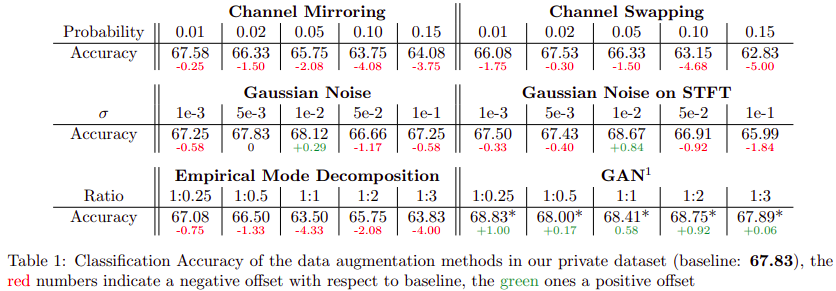

# AugmentBrain


## Table of Contents

* [About the Project](#about-the-project)
  * [Built With](#built-with)
* [Getting Started](#getting-started)
  * [Prerequisites](#prerequisites)
  * [Installation](#installation)
* [Usage](#usage)
* [Authors](#authors)
* [Acknowledgments](#acknowledgments)


## About The Project
Brain computer interfaces provide a new communication bridge between human minds and devices, however the ability to control such devices with our minds largely depends on the accurate classification and identification of non-invasive EEG signals. For this reason recent advances in deep learning have helped the progress in such field with convolutional neural networks that are becoming the new cutting edges tools to tackle the problem of EEG recognition. In order to successfully train a convolutional neural network a large amount of data are needed and due to the strict requirements for subjects and experimental environments, it is difficult to collect large-scale and high-quality EEG data.

Based on this, in ```AugmentBrain``` we investigate the performance of different data augmentation methods for the classification of Motor Imagery (MI) data using a Convolutional Neural Network tailored for EEG named EEGNet.

A brief description of the **results** is shown in the following table



More info about the whole project available at [**paper**](https://gitlab.com/ABaldrati/AugmentBrain/-/blob/master/docs/AugmentBrain_paper.pdf) and [**slides**](https://gitlab.com/ABaldrati/AugmentBrain/-/blob/master/docs/AugmentBrain_slides.pdf)

All the work is based on [Serban Cristian Tudosie](https://github.com/CrisSherban) [**BrainPad**](https://github.com/CrisSherban/BrainPad) repository.


### Built With
**Software**:
* [Python](https://www.python.org/)
* [BrainFlow](https://brainflow.org/)
* [Keras](https://keras.io/)
* [TensorFlow](https://www.tensorflow.org/)
* [ScyPy](https://www.scipy.org/)

**Hardware**:
* [OpenBCI](https://shop.openbci.com/collections/frontpage)


## Getting Started

To get a local copy up and running follow these simple steps.

### Prerequisites

We strongly recommend the use of the [**Anaconda**](https://www.anaconda.com/) package manager in order to avoid dependency/reproducibility problems.
A conda installation guide for linux systems can be found [here](https://docs.conda.io/projects/conda/en/latest/user-guide/install/linux.html)

### Installation
 
1. Clone the repo
```sh
git clone https://gitlab.com/ABaldrati/AugmentBrain
```
2. Install Python dependencies
```sh
conda env create -f environment.yml
```

***OR***

```sh
conda create -n augmentbrain -y python=3.8
conda activate augmentbrain
conda install -y tensorflow-gpu=2.4.1 matplotlib=3.3.4 scikit-learn=0.24.1
pip install brainflow==2.4 tqdm==4.60 emd==0.4
```

## Usage
Here's a brief description of each and every file under the ```src/``` directory:

* ```training.py```: model training
* ```dataset_tools.py```: dataset loading utils, preprocessing and augmentation
* ```GAN.py```: GAN training
* ```neural_nets.py```: neural nets definitions
* ```custom_callbacks.py```: keras custom callbacks which is useful in model and GAN training
* ```acquire_eeg.py```: new EEG data acquisition

Obviously in order to acquire new EEG data OpenBCI Hardware is required.


## Authors

* [**Alberto Baldrati**](https://github.com/ABaldrati)

Based on [**Serban Cristian Tudosie**](https://github.com/CrisSherban) work.


## Acknowledgments
Human Computer Interaction © Course held by Professor [Andrew David Bagdanov](https://scholar.google.com/citations?user=_Fk4YUcAAAAJ) - Computer Engineering Master Degree @[University of Florence](https://www.unifi.it/changelang-eng.html)
